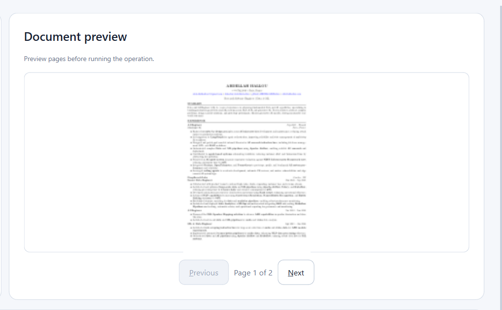
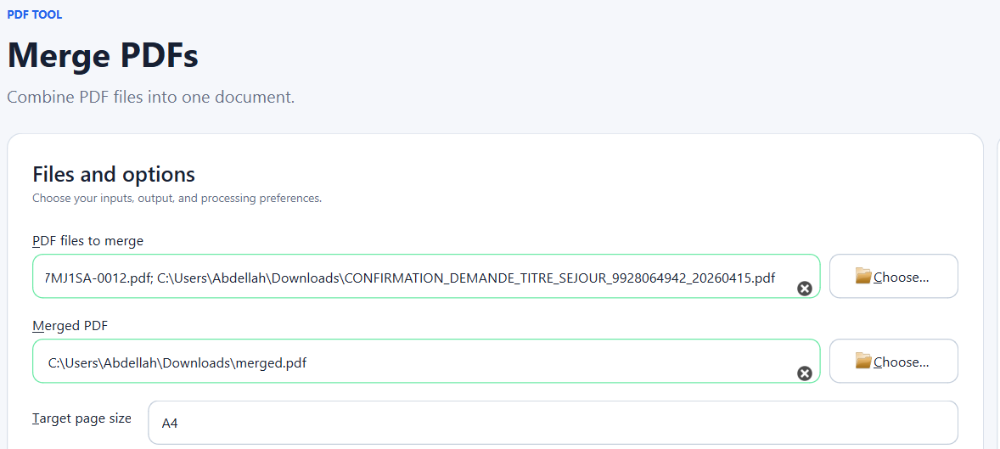
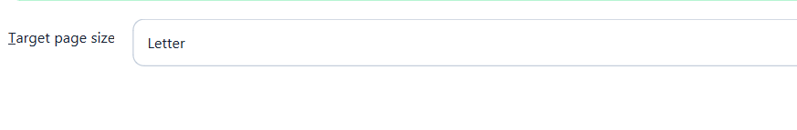
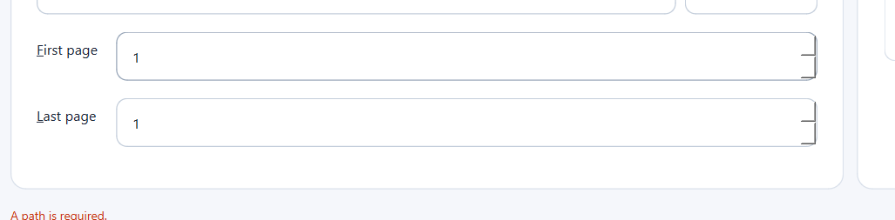

![two step process is better[ run process, view the results in preview and then click save]](image-3.png)

## Resolution

- [x] The PDF preview now renders at a higher resolution and provides zoom
      in, zoom out, and fit-to-window controls.
- [x] Merge previews include every selected PDF through an ordered document
      selector, with page navigation inside the selected document.
- [x] PDF and image inputs can be added incrementally, reordered with
      drag-and-drop or Move up/Move down, removed, and cleared.
- [x] The image-to-PDF screen now uses explicitly selected images in the
      displayed order. The CLI retains its existing folder-based workflow.
- [x] A4 and Letter normalization is represented by the canvas in the merge
      preview before processing.
- [x] PDF-producing UI operations now generate a temporary review result.
      The destination is not replaced until **Save result** is selected;
      **Discard result** removes the staged file.
- [x] Integer and decimal spin boxes use packaged, theme-compatible up/down
      arrow icons with larger click targets.
- [x] Regression coverage was added for ordered inputs, multi-document
      preview, zoom, target canvas, staged save/discard, explicit image order,
      and spin-box resources.

[] 
[] The name of this whole project changed from safepdf to PDFSilo, change this in all the project